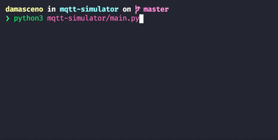

# MQTT Simulator

Easy-to-configure MQTT simulator written in [Python 3](https://www.python.org/) to simulate the sending of JSON objects from sensors or devices to a broker.

[Features](#features) •
[Getting Started](#getting-started) •
[Configuration](#configuration) •
[Authors](#authors)



## Features

* Small and easy-to-configure simulator for publishing data to a broker  
* Configuration from a single JSON file  
* Connection on pre-defined fixed topics  
* Connection on multiple topics that have a variable id at the end  
* Random variation of data generated according to configuration parameters  

## Getting Started

#### Prerequisites

* [Python 3](https://www.python.org/) (with pip)

#### Installing Dependencies

To install all dependencies with a virtual environment:

```shell
python3 -m venv venv
source venv/bin/activate
pip3 install -r requirements.txt
```

#### Running

The simulator settings can be changed in the `config/settings.json` file.

```shell
python3 mqtt-simulator/main.py
```

Runs the simulator according to the settings file.  
The terminal will show the simulator event log.

## Configuration

* The `config/settings.json` file has three main configuration parameters:

    ```json
    {
        "BROKER_URL": "mqtt.eclipse.org",
        "BROKER_PORT": 1883,
        "TOPICS": [
            ...
        ]
    }
    ```

    | Key | Type | Description | Required |
    | --- | --- | --- | --- |
    | `BROKER_URL` | string | --- | yes |
    | `BROKER_PORT` | number | --- | yes |
    | `TOPICS` | list of objects | --- | yes |

* The key **TOPICS** has a list of objects where each one has the format:

    ```json
    {
        "TYPE": "multiple",
        "PREFIX": "temperature",
        "RANGE_START": 1,
        "RANGE_END": 2,
        "TIME_INTERVAL": 25,
        "RETAIN_PROBABILITY": 0.5,
        "DATA": [
            ...
        ]
    }
    ```

    | Key | Type | Description | Required |
    | --- | --- | --- | --- |
    | `TYPE` | string | --- | yes |
    | `PREFIX` | string | --- | yes |
    | `RANGE_START` | number | --- | if `TYPE` is `"multiple"`  |
    | `RANGE_END` | number | --- | if `TYPE` is `"multiple"`  |
    | `TIME_INTERVAL` | number | --- | yes |
    | `RETAIN_PROBABILITY` | number | --- | yes |
    | `DATA` | list of objects | --- | yes |

* The key **DATA** inside TOPICS has a list of objects where each one has the format:

    ```json
    {
        "NAME": "temperature",
        "TYPE": "float",
        "RANGE_START": 30,
        "RANGE_END": 40,
        "MAX_STEP": 0.2
    }
    ```

    | Key | Type | Description | Required |
    | --- | --- | --- | --- |
    | `NAME` | string | --- | yes |
    | `TYPE` | string | --- | yes |
    | `RANGE_START` | number | --- | yes |
    | `RANGE_END` | number | --- | yes |
    | `MAX_STEP` | number | --- | yes |

## Authors

[](https://github.com/DamascenoRafael)
 [](https://github.com/Maasouza)
