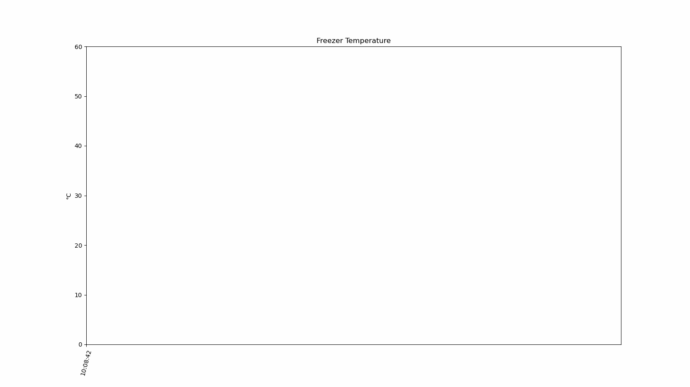
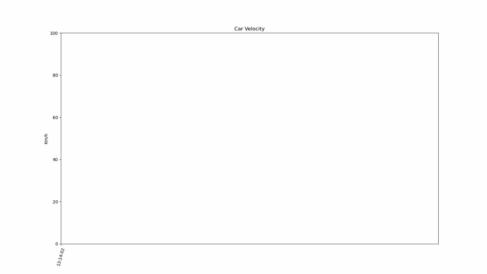

# MQTT Simulator - Data type `math_expression`

For general information on how to configure the MQTT Simulator see the [README.md](../README.md) file.

For `TYPE: "math_expression"` we need five required configuration parameters: `MATH_EXPRESSION`, `INTERVAL_START`, `INTERVAL_END`, `MIN_DELTA` and `MAX_DELTA`. Each of these have some notes:

```json

{
    ... 
    "TYPE": "math_expression",
    "MATH_EXPRESSION": "x**2",
    "INTERVAL_START": 30,
    "INTERVAL_END": 40,
    "MIN_DELTA": 0.1,
    "MAX_DELTA": 0.2,
    ...
}
```

* `MATH_EXPRESSION`: 
  * The `MATH_EXPRESSION`'s variable **must** be defined as `x`. 
  * Any *Pythonic* expression is valid, so, for instance, if you declare it as `x**2` or `math.pow(x,2)` the generated function will be the same.

* `INTERVAL_START` and `INTERVAL_END`: 
  * These parameters will works as the function domain, restricting the value that `x` can reach. 
  * When the variable `x > INTERVAL_END`, the function will be evaluated, and then the variable will be reset to `x=INTERVAL_START`. So keep in mind that the real interval is `[INTERVAL_START,INTERVAL_END+MAX_DELTA)`.

* `MIN_DELTA` and `MAX_DELTA`:
  * It is possible to set both with the same value, in this case, it is expected that the curves are more similar between the "loops", and may be identical if `RETAIN_PROBABILITY = 0`.

## Example 1 - Freezer Temperature

In the example below the `MATH_EXPRESION` = $2x²+1$, `INTERVAL_START = 0`, `INTERVAL_END = 5`, `MIN_DELTA = 0` and `MAX_DELTA = 0.5`, so it is expected that the generated values are between 1 and 61.5, and the curves should be slightly different.


```json
 {
    "TYPE": "single",
    "PREFIX": "freezer",
    "TIME_INTERVAL": 6,
    "DATA": [
        {
            "NAME": "temperature",
            "TYPE": "math_expression",
            "RETAIN_PROBABILITY": 0.1,
            "MATH_EXPRESSION": "2*math.pow(x,2)+1",
            "INTERVAL_START": 0,
            "INTERVAL_END": 5,
            "MIN_DELTA": 0.5,
            "MAX_DELTA": 0.5
        }
    ]
}

```



## Example 2 - Car Velocity

In the example below the `MATH_EXPRESION` = $\sqrt{75x}$, `INTERVAL_START = 0`, `INTERVAL_END = 100`, `MIN_DELTA = 10` and `MAX_DELTA = 10`, so it is expected that the generated values are between 0 and 87. As `REATIN_PROBABILITY = 0` and the `MIN_DELTA` and `MAX_DELTA` are identicals, the curves must be identicals.


```json
{
    "TYPE": "single",
    "PREFIX": "car",
    "TIME_INTERVAL": 6,
    "DATA": [
        {
            "NAME": "velocity",
            "TYPE": "math_expression",
            "RETAIN_PROBABILITY": 0,
            "MATH_EXPRESSION": "(75*x)**(1/2)",
            "INTERVAL_START": 0,
            "INTERVAL_END": 100,
            "MIN_DELTA": 10,
            "MAX_DELTA": 10
        }
    ]
}
```


